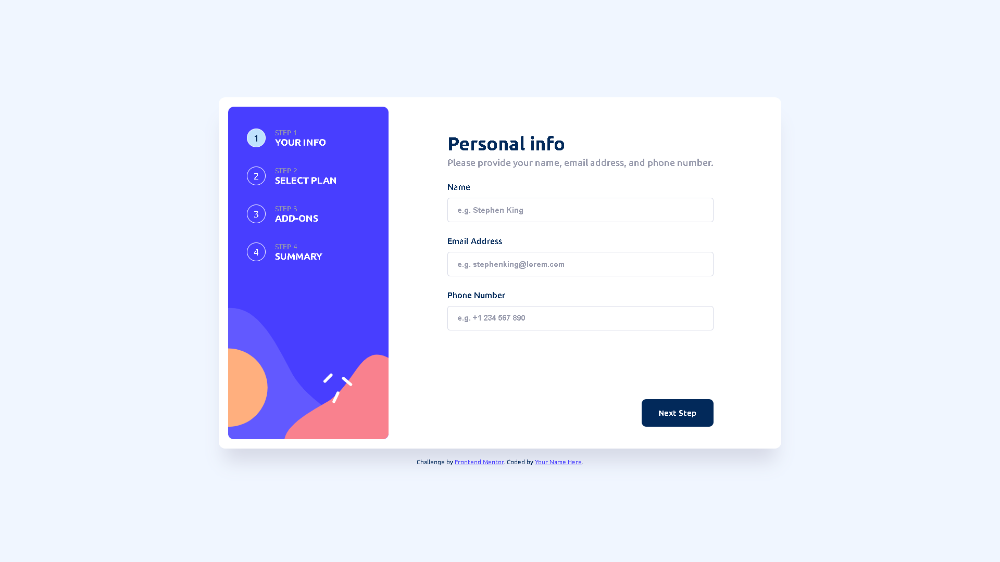

# Frontend Mentor - Multi-step form solution

## Table of contents

- [Overview](#overview)
  - [The challenge](#the-challenge)
  - [Screenshot](#screenshot)
  - [Links](#links)
- [My process](#my-process)
  - [Built with](#built-with)
  - [What I learned](#what-i-learned)
  - [Continued development](#continued-development)
- [Author](#author)

## Overview

### The challenge

Users should be able to:

- Complete each step of the sequence
- See a summary of their selections on the final step and confirm their order
- View the optimal layout for the interface depending on their device's screen size
- See hover and focus states for all interactive elements on the page

### Screenshot



### Links

- Solution URL: [solution URL here](https://github.com/Theuz1nh0/-multi-step-form)
- Live Site URL: [live site URL here](https://theuz1nh0.github.io/-multi-step-form/)

## My process

### Built with

- Semantic HTML5 markup
- CSS custom properties
- Flexbox
- Mobile-first workflow
- [React](https://reactjs.org/) - JS library

### What I learned

I learned how to use React hooks like "useState"
```jsx
    const [data, setData] = useState(formTemplate)
```

I also learned how to create multiple containers with the same component with ".map"
```jsx
    <div className="step-bar">
      {arrayInformationsStep.map(step => <StepInformations key={step.num} array={step} step={currentStep} />)}
    </div>
```

### Continued development

I intend to keep practicing React and learn new things like Bootstrap and Sass 


## Author

- Frontend Mentor - [@Theuz1nh0](https://www.frontendmentor.io/profile/Theuz1nh0)
- Linkedin - [Mateus Moura Domingos](https://www.linkedin.com/in/theuz1nh0/)
